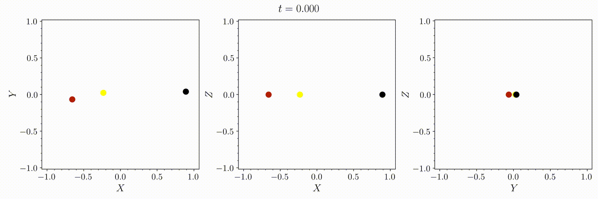
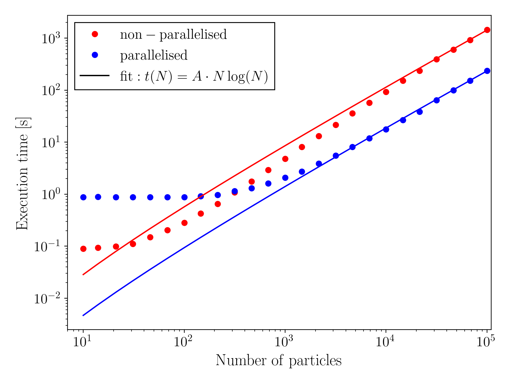

# Exercise 2
[](https://github.com/DavidMirabal)  



<!-- TABLE OF CONTENTS -->
<details>
<summary><strong><span style="font-size: 20px;">Table of Contents</strong></summary>
  <ol>
    <li>
      <a href="#description">Description</a>
    </li>
    <li>
      <a href="#how-to-compile">How to compile</a>
      <ul>
        <li><a href="#without-parallelization">Without parallelization</a></li>
        <li><a href="#with-parallelization">With parallelization</a></li>
        <li><a href="#tests">Tests</a></li>
      </ul>
    </li>
    <li><a href="#usage">Usage</a>
    <ul>
        <li><a href="#ic-generator">IC generator</a></li>
        <li><a href="#videos">Videos</a></li>
      </ul>
    </li>
    <li><a href="#output-files">Output files</a></li>
    <li><a href="#execution-time">Execution time</a></li>
    <li><a href="#acknowledgments">Acknowledgments</a></li>
  </ol>
</details>


## Description

The goal of this exercise is to implement a parallel version of the sequential program from exercise 1. 
The program must be implemented using OpenMP. Additionally, the Barnes-Hut algorithm is used for the N-body simulation.

The Barnes-Hut algorithm is an approximation algorithm used to simulate the motion of a particle system under the influence of gravity. It reduces the complexity of the problem from $O(N^2)$ to $O(N \log N)$ by dividing the space into a hierarchical tree structure (octree in 3D) and approximating the influence of distant bodies with their center of mass. 

The parameter $\theta$ (usually set to 1) is fixed in the initial conditions files. This parameter serves as a criterio for grouping or not certain particles when calculating the acceleration of another one. If $\theta$ is small, the algorithm requires higher precision in the calculations and only groups particles if the angle subtended by the center of mass of a group is small, meaning the group is more "compact". If $\theta$ is large, the algorithm allows larger approximations and can group particles that are more dispersed, so reducing computation time.

A softening length also is also added. It can be changed from the initial conditions file.

> [!IMPORTANT]  
> All commands in this `README` must be executed from the main directory: `ex2/`

## How to compile

If you have a previous version it is recommended to do first:

```sh
make clean
``` 

### Without parallelization:
To compile the code (non-parallel version) you can use the following command:

```
make
```

### With parallelization:
To compile the code (parallel version) you can use the following command:

```sh
make parallel
```

### Tests

Several tests are provided to verify that the code works correctly. There are two types of tests:
 - With few particles in stable orbits to check that the code maintains those stable orbits and provides the expected output.
 - To ensure that execution times are not significantly greater than expected.

To run only the first set of tests, you must execute:
```sh
make test
```

> [!WARNING]
> The first tests should execute in a few seconds, but running the second type of tests can take between 10-20 minutes in the parallelized version. In the non-parallelized version, these can take up to an hour.
>
> These tests were used to calculate the execution times shown in the last graph of this `README`.

To run all the tests, you should execute:
```sh
make test_all
```

## Usage

You can use the code with input files or by introducing initial conditions in the terminal.

- With input files:

```sh
./ex2 ics/ic_template.txt
```

- With terminal input:

```sh
./ex2 
```

This will generate output files with the position of the particles at each simulation time in `ouput/template.txt`.

To run all the simulations with a file of initial conditions in `ics/` you can do:

```sh
make all_ics
```


### IC generator
You can generate initial conditions with many particles uniformly distributed within a sphere. You can specify the number of spheres and adjust their sizes and positions. To do this:

```sh
python ics/generator_ics.py 
```


### Videos

To create a video, you can do it in two ways:
> [!WARNING]
> To generate a video, you must install [*FFmpeg*](https://www.ffmpeg.org/).

#### With make:
```sh
make video SIM_NAME=template
``` 
`template` is the name of the simulation, so the input file should be `ics/ic_template.txt`, the output file `output/template.txt`, and the video `videos/template.mp4`.

You can manually change several video parameters such as `INPUT_FILE`, `OUTPUT_FILE`, `NUM_CORES` (defaults to the maximum available), `DIRECTORY_IMAGES` (the directory where images are saved), `DIRECTORY_VIDEO` (the directory where the video is saved), `TITLE`, `FPS`, `RESIZE` (resize factor to reduce the video size), and `DELETE` (whether to delete images created during video creation; defaults to True).
```sh
make video SIM_NAME=template INPUT_FILE=ics/ic_template.txt OUTPUT_FILE=output/template.txt NUM_CORES=8 DIRECTORY_IMAGES=output/images_template/ DIRECTORY_VIDEO=videos/ TITLE=template FPS=30 RESIZE=1
``` 

To create all the videos of the simulations that have an output file in `output/` you can do:

```sh
make all_videos
```

#### Manually: 
You can run each Python script by hand to make the video:
```sh
python visual/plot_images.py output/template.txt ics/ic_template.txt 8
python visual/image_to_video.py output/images_template/ 30 videos/ template 1
```

8 is the number of cores (threads) to use, 30 is fps and 1 is the resize factor.

## Output files

The output files will be saved in the `output/` directory. They start with a Python-commented header that describes the information of each column. Each line represents a particle with its ID, position, mass, and simulation time. As a result, all outputs have the same number of columns, making them easier to read. Since the ID and time for each particle are saved, it is possible to track them over time. The last line of the output file (also commented for Python) shows the time it took to run the simulation.

In `visual/utils.py`, there is a function `called read_data(output_file)` that can be imported to read the output files. This function returns the positions of the particles in an $M\times3$ array, their masses, the simulation times, and the time it took to run the simulation. It also returns a list of $N$ ($N$ = particle number) elements, where each element is a boolean array that can be used to index the positions array to distinguish the particles. For example:

```py
from visual import utils

pos, ids, mass, time, exec_time = utils.read_data('output/template.dat')

pos_part1 = pos[ids[0]]  #Lx3 array that have positions of the first particle along time
time_part1 = pos[ids[0]] #L array that have times of the first particle

plt.plot(time_part1, pos_part1[:, 0]) #figure that show the change in the X-position of one particle along time
```

Output file example:

```sh
#Index            X            Y            Z         Mass         Time
     1  -3.38644E-01  9.16348E-02  0.00000E+00  1.00000E+00  9.90000E-02
     2   2.11524E+00 -9.21734E-03  0.00000E+00  1.00000E+00  9.90000E-02
     3  -1.77660E+00 -8.24175E-02  0.00000E+00  1.00000E+00  9.90000E-02
     1  -3.43275E-01  1.82633E-01  0.00000E+00  1.00000E+00  1.99000E-01
     2   2.11177E+00 -1.83792E-02  0.00000E+00  1.00000E+00  1.99000E-01
     3  -1.76849E+00 -1.64254E-01  0.00000E+00  1.00000E+00  1.99000E-01
     1  -3.50772E-01  2.72404E-01  0.00000E+00  1.00000E+00  2.99000E-01
     2   2.10830E+00 -2.45678E-02  0.00000E+00  1.00000E+00  2.99000E-01
     3  -1.76030E-00 -2.31456E-01  0.00000E+00  1.00000E+00  2.99000E-01
     ...
     3   4.09912E-01  9.12125E-01  0.00000E+00  1.00000E-06  1.99970E+00
#Simulation execution time:    17.338968
```

## Execution Time

The following figure shows the execution time of different simulations with different numbers of particles. The red line represents the non-parallelized version, and the blue line represents the parallelized version. Additionally, the theoretical function that this code should follow is fitted to the data. All these simulations have been run with the same settings (same time steps and simulation duration). In addition, the number of times a line is written to the output has been minimised (maximise dt_out) in order to include as few write effects as possible in the computation time.




For a large number of particles, the parallelized version is faster, with an improvement close to x10. This is because parallelization allows distributing the work among multiple processing cores. These tests have been carried out on a 16 core computer, so the maximum theoretical improvement would be x16, obviously this is not achieved because it is not always calculating. For example there are times when the processor is waiting for data and it loses efficiency.

However, for a small number of particles, the non-parallelized version is faster. This is because it does not have to open parallelization, distribute the data among the cores, etc, which introduces additional overhead in the parallelized version.

The reason why the computation time does not increase for a small number of particles when the number of particles is increased is probably because, in that region, the simulation is not limited by pure calculation. Instead, it is likely due to writing or opening and closing parallelization in the parallelized case.

## Acknowledgments
[](https://github.com/rreusser)  

The initial conditions for the three-body examples have been obtained from [rreusser](https://observablehq.com/@rreusser/periodic-planar-three-body-orbits). Specifically from [Broucke, R. (1975)](https://doi.org/10.1007/BF01595390). 


